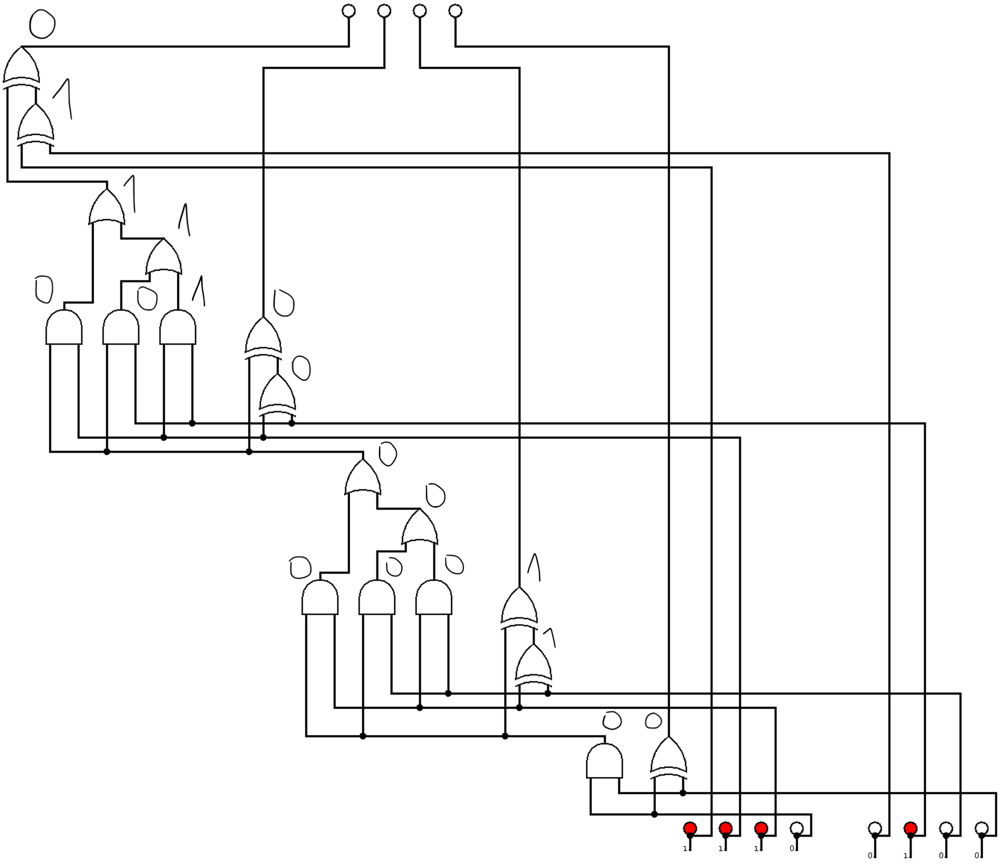

# Badd Circuit


## Challenge Statement

Here is a logic circuit that implements an unknown function. What is the value of the four output bits?

The flag format is FCSC{<value>}. For example, if the value to find is 0001, the flag would be FCSC{0001}.

Warning: This challenge is limited to 3 submission attempts.

---

## Solution

1. **Circuit Analysis**:  
   We begin by analyzing the provided logic circuit diagram to determine the relationships between inputs and outputs.

2. **Input Configuration**:  
   Based on the logic gates and connections in the circuit, we carefully map out the inputs.

3. **Calculating Output**:  
   After performing the necessary logical operations, we derive the correct output bits.

4. **Result**:  
   The final output is `0010`, which is the correct value.



---

## Flag

```
FCSC{0010}
```
