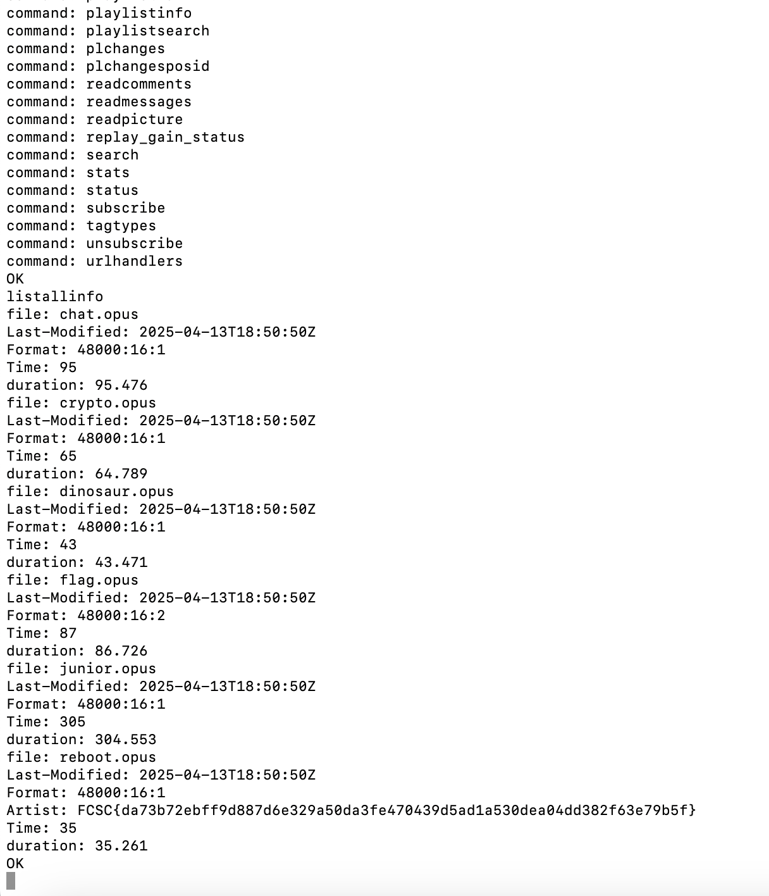

# Voilà (Baby)


## Challenge Statement

> Alice loves listening to music. Unfortunately, she misconfigured her firewall and accidentally exposed her music collection on the Internet. Alice organizes her personal collection in an unconventional way: instead of sorting by genre, album, or artist, she renames her music files based on her imagination.
> 
> To begin, connect to her music collection and find the hidden flag in the metadata.
> 
> Alice's music collection is accessible at:
> ```
> nc chall.fcsc.fr 2052
> ```

---

## Solution

First, we connected to the server:

```bash
nc chall.fcsc.fr 2052
```

We discovered that the server was running **MPD** (Music Player Daemon).

To list available commands, we typed:

```text
commands
```

Then, we listed all available files and their metadata with:

```text
listallinfo
```

The server returned multiple music files. Among them, one file (`reboot.opus`) contained metadata with the flag inside the **Artist** field:

```text
file: reboot.opus
Last-Modified: 2025-04-13T18:50:50Z
Format: 48000:16:1
Artist: FCSC{da73b72ebff9d887d6e329a50da3fe470439d5ad1a530dea04dd382f63e79b5f}
Time: 35
duration: 35.261
```





---

## Flag

```
FCSC{da73b72ebff9d887d6e329a50da3fe470439d5ad1a530dea04dd382f63e79b5f}
```
