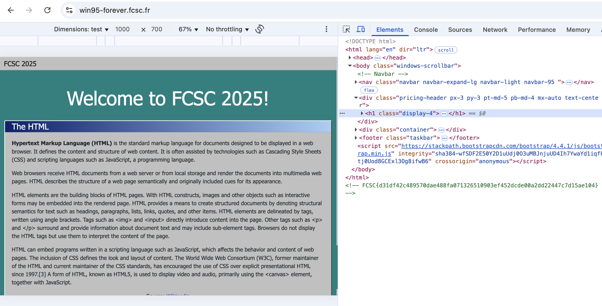

# Win95 Forever


## Challenge Statement

> Welcome in the nineties!
> 
> https://win95-forever.fcsc.fr/

---

## Solution

We accessed the website:

> https://win95-forever.fcsc.fr/

Once on the page, we opened the browser's Developer Tools (`Inspect Element`) and checked the page source.  
By scrolling to the very end of the HTML code, we found a hidden HTML comment containing the flag:

```html
<!-- FCSC{d31df42c489570dae488fa071326510903ef452dcde00a2dd22447c7d15ae104} -->
```




---

## Flag

```
FCSC{d31df42c489570dae488fa071326510903ef452dcde00a2dd22447c7d15ae104}
```
