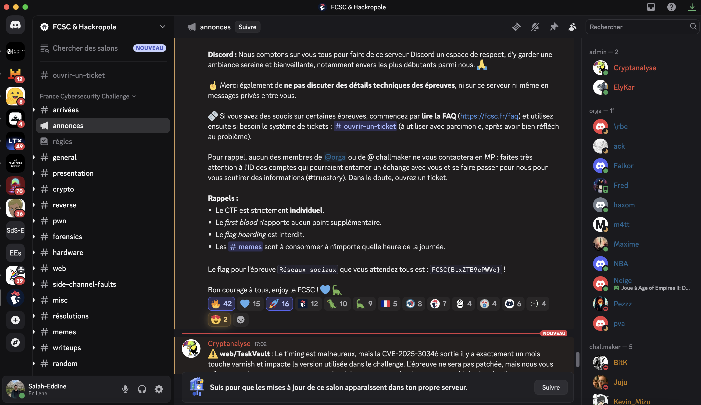

# Réseaux sociaux


## Challenge Statement

> A message has been hidden in the various announcements of the FCSC, will you be able to find it?
> 
> Note: If you wish to contact the organizing team during the FCSC to report an issue or share memes, the most effective way is to join the FCSC Discord server:
> 
> https://discord.gg/rwZY6hh8z8

---

## Solution

The challenge hints that the hidden message is related to the FCSC announcements.  
By joining the FCSC Discord server and checking the `#annonces` channel, we find the following message:

> Le flag pour l'épreuve Réseaux sociaux que vous attendez tous est : FCSC{BtxZTB9ePWVc} !

Here’s a screenshot showing the message:



---

## Flag

```
FCSC{BtxZTB9ePWVc}
```
