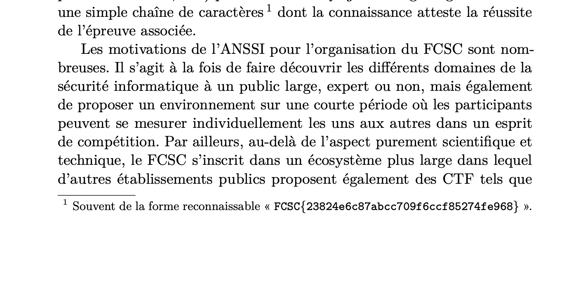

# SSTIC

**Points**: (not specified)

---

## Challenge Statement

> The FCSC organizing team has published a feedback report at SSTIC 2024 (in PDF and/or video format). In it, we provide, in French, a number of organizational and technical details about the FCSC, particularly regarding the management of the infrastructure we use. Will you be able to find the hidden flag in this publication?
> 
> https://www.sstic.org/

---

## Solution

First, we searched on Google for:
> Retour d’expérience sur l’organisation d’un CTF SSTIC

This led us to the following PDF publication:
> [Retour d’expérience sur l’organisation d’un CTF – SSTIC 2024](https://www.sstic.org/media/SSTIC2024/SSTIC-actes/ctf_fcsc/SSTIC2024-Article-ctf_fcsc-thuau_iooss_court_jean_olivier_claverie_yJj0x1s.pdf)

After downloading the PDF, we performed a simple text search inside the document for:
```
FCSC{
```

This search revealed the hidden flag.



---

## Flag

```
FCSC{23824e6c87abcc709f6ccf85274fe968}
```
